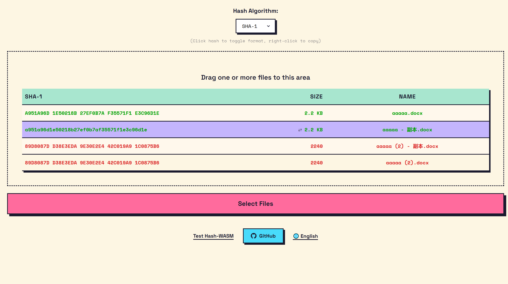

# File Hash Comparator

A browser-side file hash calculation tool. No upload needed, all processing is done locally.

Primarily used for comparing hash values between multiple files.

Uses the browser's standard functions to calculate hash values. Due to limitations of the standard functions, [hash-wasm](https://github.com/Daninet/hash-wasm) is introduced for streaming calculation of large files.

Supported Hash Algorithms: SHA-1, SHA-256, SHA-384, SHA-512.

## Live Demo

[Live Demo](https://files-hash-in-browser.vercel.app/)

[](https://vercel.com/new/clone?repository-url=https://github.com/xavierskip/files_hash_in_browser&repository-name=files_hash_in_browser)



## Features

- Uses Web Crypto API (`crypto.subtle.digest`) for hash calculation
- Supports multiple hash algorithms: SHA-1, SHA-256, SHA-384, SHA-512
- Parallel hash computation for multiple files
- Drag and drop files or click button to select files
- Smart calculation: Uses native browser API for small files, switches to streaming calculation for large files (≥2GB)
- **Click to toggle**: Click hash value to switch between compact and readable format (space every 8 characters); click size to switch between bytes and KB/MB/GB
- **Right-click to copy**: Right-click hash value to copy current display format to clipboard
- Compares against the first file as baseline, same hash displayed in green, different in red
- Supports URL parameter for pre-selecting algorithm: `?hash=sha-256` (case-insensitive)
- PWA support for offline use

## Usage

Drag files to the designated area on the page to display their hash values. You can drag multiple files at once or add files multiple times to get hashes for comparison. The **first file's hash value is used as the standard** - matching hashes are displayed in green, different ones in red, making it easy to see if files are identical at a glance.

## Background

I often receive files from different people, and sometimes the filenames are different but they're the same file, or the filenames are the same but they're different files. This is confusing - I don't know if a file is new or a duplicate. Obviously, the best way to compare files is by comparing their hash values. I usually use the "CRC SHA" feature provided by 7zip in the right-click menu, but not only does it require multiple clicks in a submenu, each file pops up in a separate window making visual comparison impossible. So I wanted to create a **GUI application that displays file hashes together** for easy comparison, and it must **support drag and drop operations** to avoid navigating between different file paths and making mistakes.

## Technologies Used

- Multiple hash algorithms: SHA-1, SHA-256, SHA-384, SHA-512
- Parallel file hash retrieval
- Uses Web Crypto API (`crypto.subtle.digest`) for hash calculation
- Supports URL parameter for pre-selecting algorithm: `?hash=sha-256` (case-insensitive)
- PWA application supports offline use

## Project Structure

```
src/fileshash/
├── index.html              # Single-page layout with algorithm selector, drop zone and results table
├── main.js                 # Core logic: drag-drop handling, hash calculation, visual comparison
├── style.css               # Styles: color-coded results (green/red), responsive table layout
├── i18n.js                 # Multi-language internationalization support
├── manifest.json           # PWA app manifest configuration
├── service-worker.js       # Service Worker for offline caching
├── icon-128x128.png        # PWA icon (128x128)
├── icon-192x192.png        # PWA icon (192x192)
├── icon-512x512.png        # PWA icon (512x512)
├── screenshot-narrow.png   # PWA narrow screen screenshot
└── screenshot-wide.png     # PWA wide screen screenshot
```

## Local Development

This is a pure static web project with no build tools or dependencies required.

```bash
# Serve the src/fileshash/ directory with any static server
python -m http.server 8000 --directory src/fileshash/
# Or use npx for better MIME type handling
npx serve src/fileshash/
```

Then visit http://localhost:8000

## Notes

The browser standard function [crypto.subtle.digest](https://developer.mozilla.org/en-US/docs/Web/API/SubtleCrypto/digest) does not support streaming input. Since this API requires loading the entire file into memory, it is limited by browser constraints and cannot calculate hash values for large files. (Desktop browsers typically have a 2GB memory limit, mobile browsers may have even stricter limits).

Therefore, for very large files, [hash-wasm](https://github.com/Daninet/hash-wasm) is used for streaming chunked calculation, which supports extremely large files.