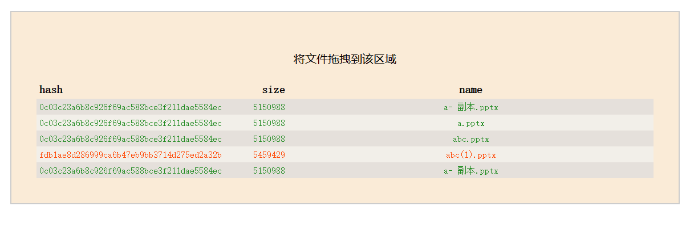

## 作用
将文件拖拽到页面指定位置，就可以在页面中显示文件的sha1 hash值，可以拖入多个文件，同时得到多个文件hash值用于比对，以**第一个文件的hash值作为标准**，与之相同的显示为绿色字体，不同则为红色字体，这样，这些文件是不是相同文件一目了然。

## 产生背景
经常会有不同的人发文件给我，有可能的情况是文件名不一样但是是同一个文件，也有可能文件名一样但不是同一个文件，这十分让我困惑，我不知道这个文件是新的文件还是重复的文件，显然最好比较文件是否相同的方法就是比较文件的hash值，我平常都是使用的右键菜单里7zip提供的"CRC SHA"功能，不仅要在二级菜单中多点几次鼠标，而且每个文件弹出来的都是一个独立的窗口，肉眼无法直观的进行比对，于是想制作一个**能够把文件hash值显示在一起的GUI软件**，便于比对，而且要**支持鼠标拖拽操作**，这样可以不用在文件的路径中选来选去容易出错了。

还是本来想需求不复杂，想学习学习新的Windows客户端开发技术，可是最后还是用回了熟悉的html加js，谁说浏览器界面不是界面呢？谁现在还不开一个浏览器呢？但是我的js技术还是10年前的水平，不会也没有用任何外部库和组件，用的都是原生API加CSS样式。这样我全程在ChatGPT的帮助下完成了这个项目。

## 采用的技术
- sha1 作为文件的hash值。
- 并行获取文件的hash。

## 目前发现的问题
超过2GB大小文件无法获取到hash值。可能是某些浏览器沙箱的限制。

## 截图

Translate：

## role of software

Dragging files to a web page displays their SHA1 hash values on browser. Multiple files can be dragged in simultaneously, and the hash values of all the files can be obtained for comparison. Using the hash value of the first file as the standard, any file with the same value will be displayed in green font, while any file with a different value will be displayed in red font. In this way, it is immediately clear whether or not these files are the same one.

## background

Often there are different people sending me files, and it is possible that the file names are not the same but they are the same file, or the file names are the same but they are not the same file, which is very confusing for me. Obviously, the best way to compare whether files are the same is to compare their hash values. Normally, I use the "CRC SHA" function provided by 7zip in the right-click menu. I have to click the mouse several times in the secondary menu, and each file pops up in a separate window, which cannot visually compare the hash values. Therefore, I want to create a GUI software that can display the hash values of files together for comparison, and it needs to support mouse drag-and-drop operations, so that I can avoid selecting files from the path, which is easy to make mistakes.

At first, I thought the requirements were not complicated, and wanted to learn new Windows client development techniques, but in the end, I went back to using familiar HTML and JS. Who said that the browser interface is not an interface? Who doesn't open a browser these days? However, my JS skills are still at the level they were 10 years ago. I didn't use any external libraries or components, and used only native APIs and CSS styles. With ChatGPT's help, I completed this project.

## technical details
- The hash value used for the files was sha1.
- Parallel retrieval of the hash value of files was implemented.

## known issue
Files larger than 2GB in size could not be hashed. This may have been due to limitations of certain browser sandboxes.